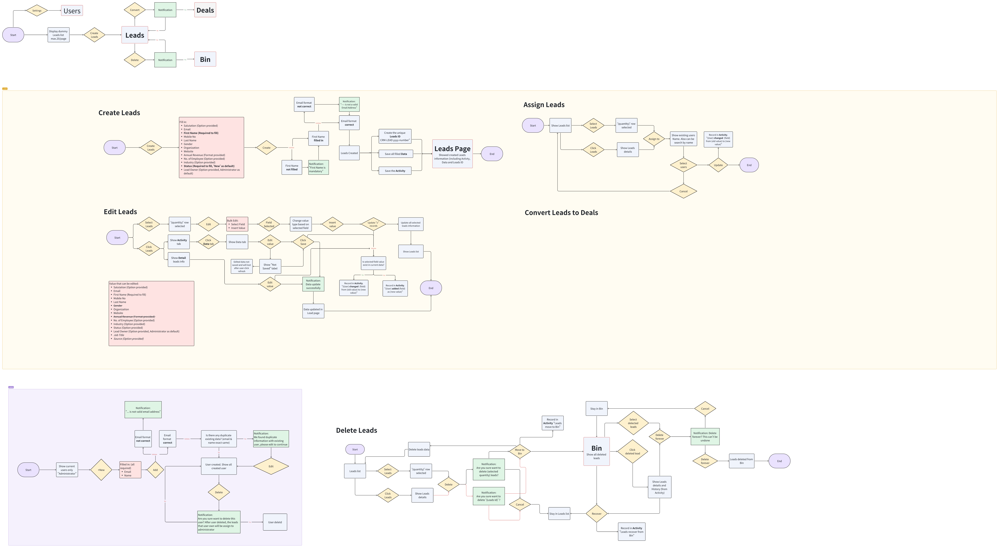

# Blueberry CRM

A simple Customer Relationship Management (CRM) system build with JavaScript for portofolio purpose. This project is a simplified CRM system developed as a learning exercise to studying fundamental web development concept.

Learning Reference: 
- [Frappe CRM](https://frappe.io/crm)
- [Google Contact](https://contacts.google.com/)

## Features
### Leads Management
- Add new leads
- Edit leads
- Delete leads
- Assign leads to users

### User Management
- Create new users
- Delete users

### Deals Management
- Basic deals tracking

### Bin/Trash
- Recover deleted items
- Permanent deletion

## Flowchart
You can find the flowchart document link [here](https://k7kmlhb6m6.larksuite.com/docx/Lj5Pd2g0jo4Vb0xxbycuqCGOsCe?from=from_copylink)

